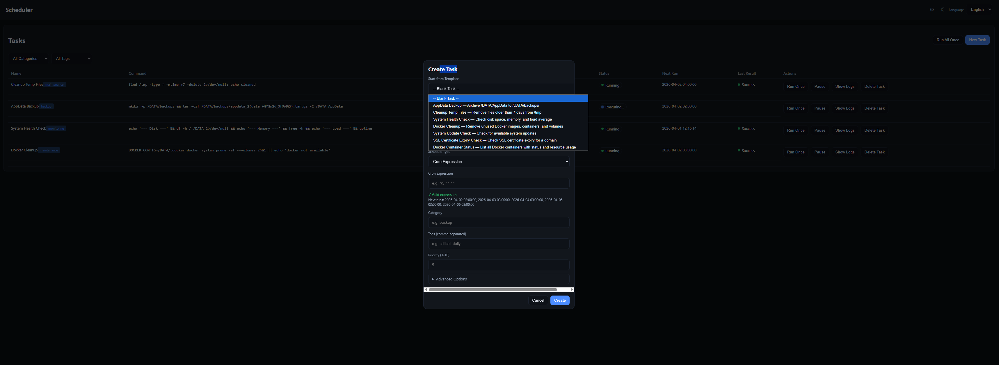

# Cron 
[](https://github.com/IceWhaleTech/ZimaOS)
[](https://github.com/chicohaager/cron)
[](LICENSE)

A modern, reliable task scheduler for ZimaOS with a completely redesigned web interface. Replaces the previous cron implementation with improved task persistence, advanced scheduling options, and comprehensive notification support.

## ✨ Features

- **Brand-new Scheduler UI** – Clean, dark-themed dashboard for managing all scheduled tasks
- **Persistent Tasks** – Tasks survive system restarts and continue running reliably
- **Built-in Templates** – Quick-start templates for common tasks:
  - AppData Backup (Archive /DATA/AppData)
  - Cleanup Temp Files (Remove files older than 7 days)
  - System Health Check (Disk space, memory, load average)
  - Docker Cleanup (Remove unused images, containers, volumes)
  - System Update Check
  - SSL Certificate Expiry Check
  - Docker Container Status
- **Flexible Scheduling** – Interval-based (minutes) or cron expressions
- **Task Dependencies** – Define execution order with "Depends On"
- **Priority System** – Set task priority (1-10)
- **Categorization & Tags** – Organize tasks with categories and comma-separated tags
- **Real-time Status** – Monitor running/paused tasks with live status indicators
- **Execution Logs** – View logs per task with export options (CSV, JSON)
- **Multi-Channel Notifications**:
  - 📱 **Telegram** – Global bot notifications for all tasks
  - 🌐 **Webhook** – HTTP POST to any endpoint
  - 📧 **Email (SMTP)** – Per-task email alerts
- **Advanced Options**:
  - Timeout (seconds)
  - Retry Count & Retry Delay
  - Environment Variables
  - Max Log Entries
  - Parallel Execution Control

## 📸 Screenshots



## 🚀 Installation

### ZimaOS 1.6.0+

The Cron module comes pre-installed with ZimaOS 1.6.0 and later.

### Manual Installation (ZimaOS 1.2.5+)

```bash
zpkg install cron
```

Or download from [Releases](https://github.com/chicohaager/cron/releases) and install manually:

```bash
zpkg install cron.raw
```

## 🔧 Usage

Access the **Scheduler** from your ZimaOS dashboard sidebar.

### Creating a Task

1. Click **"New Task"** in the top right corner
2. Select a template or start with "Blank Task"
3. Configure:
   - **Name** – Descriptive task name
   - **Schedule Type** – Interval (minutes) or Cron expression
   - **Category** – e.g., `backup`, `maintenance`, `monitoring`
   - **Tags** – e.g., `critical, daily`
   - **Priority** – 1 (highest) to 10 (lowest)
4. Expand **Advanced Options** for:
   - Timeout, Retry settings
   - Task dependencies
   - Webhook/Email notifications
5. Click **"Create"**

### Task Templates

| Template | Description |
|----------|-------------|
| AppData Backup | Archive /DATA/AppData to /DATA/backups/ |
| Cleanup Temp Files | Remove files older than 7 days from /tmp |
| System Health Check | Check disk space, memory, and load average |
| Docker Cleanup | Remove unused Docker images, containers, and volumes |
| System Update Check | Check for available system updates |
| SSL Certificate Expiry Check | Check SSL certificate expiry for a domain |
| Docker Container Status | List all containers with status and resource usage |

### Filtering Tasks

Use the dropdown filters at the top:
- **All Categories** – Filter by category
- **All Tags** – Filter by assigned tags

### Task Actions

Each task row provides quick actions:
- **Run Once** – Execute immediately
- **Pause / Resume** – Toggle task scheduling
- **Show Logs / Hide Logs** – Expand inline log viewer
- **Delete Task** – Remove the task

### Viewing Logs

Click **"Show Logs"** to expand the log section for any task. Options:
- **Search logs** – Filter log entries
- **Export CSV** – Download logs as CSV
- **Export JSON** – Download logs as JSON
- **Clear Logs** – Remove all log entries for this task

## 🔔 Notifications

### Telegram Notifications (Global)

Configure global Telegram notifications in **Settings** (gear icon). These apply to all tasks.

1. Create a Telegram bot via [@BotFather](https://t.me/botfather)
2. Copy your **Bot Token** (e.g., `123456:ABC-DEF...`)
3. Get your **Chat ID** (e.g., `-1001234567890` for groups)
4. Select when to notify:
   - ☐ On Success
   - ☑ On Failure
5. Click **"Test"** to verify, then **"Save"**

### Webhook Notifications (Per-Task)

Configure a webhook URL in the task's Advanced Options to receive POST requests:

```
https://example.com/webhook
```

Select when to trigger:
- ☐ On Success
- ☑ On Failure

### Email Notifications (Per-Task)

Configure SMTP settings in the task's Advanced Options:
- **Recipient** – e.g., `admin@example.com`
- **SMTP Server** – e.g., `smtp.gmail.com`
- **Port** – e.g., `587`
- **Username** – SMTP username
- **Password** – SMTP password or app password

## 🛠 Technical Details

### Data Storage

Task configurations and logs are stored in:
```
/DATA/AppData/cron/
```

### Persistence

Tasks are persisted to disk and automatically restored after system restart. This fixes the known issue where tasks did not continue after a reboot in previous versions.

### Dependencies

Tasks with dependencies will only execute after all dependent tasks have completed successfully.

## 🐛 Fixed Issues

- **Tasks not continuing after restart** – Tasks now persist across reboots
- **UI not loading in 1.6.0beta1** – Completely rewritten frontend
- **Missing task logs** – Logs are now reliably stored and exportable

## 🤝 Contributing

Contributions are welcome! Please feel free to submit a Pull Request.

- **Repository**: [github.com/chicohaager/cron](https://github.com/chicohaager/cron)
- **Issues**: [Report a bug](https://github.com/chicohaager/cron/issues)

## 📄 License

This project is licensed under the MIT license - see the [LICENSE](LICENSE) file for details.

## 🙏 Acknowledgments

- [IceWhale Technology](https://github.com/IceWhaleTech) – ZimaOS Team
- [@LinkLeong](https://github.com/LinkLeong/zima_cron) – Original author
- [@Lintuxer](https://github.com/chicohaager) – Various code changes
- Community contributors and testers

---

**Made with ❤️ for the ZimaOS Community**
